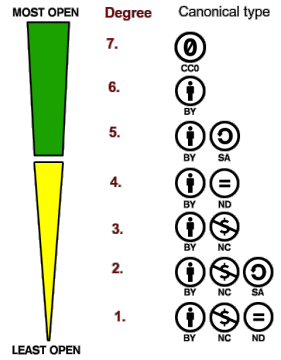

# Open Coherence
This project, a mini-framework for check openness-coherence of legal and scientific contents, offers tools and datasets for describe open contents with certainty of openness and tools for measure the degreee of openess.

## Introduction
Legal and scientific documents are typical [free contents](https://en.wikipedia.org/wiki/Free_content#Legislation), and in recent years they are stored in big digital repositories that archives publicly accessible full-text documents in standard formats, as a form of *digital [legal deposit](https://en.wikipedia.org/wiki/Legal_deposit)*.

* Typical repositories of scientific literature (''sci-docs''): [SciELO](https://en.wikipedia.org/wiki/SciELO) and [PubMed Central](https://en.wikipedia.org/wiki/PubMed_Central). Access to contents in [XML JATS format](https://en.wikipedia.org/wiki/Journal_Article_Tag_Suite) and PDF.

* Typical repositories of legislation (''law-docs''): [BR (LexML)](http://www.lexml.gov.br/),  [EU countries (N-Lex)](http://eur-lex.europa.eu/n-lex/), [UK (legislation)](http://www.legislation.gov.uk/browse). Access to contents in HTML, PDF and other formats.

In both (sci-docs and law-docs) the content is published by an authority, like a [scientific journal](https://en.wikipedia.org/wiki/Scientific_journal) or a [government gazette](https://en.wikipedia.org/wiki/Government_gazette). Only official versions of the documents possess legal probative value. The *official repositories* preserves the documents and its  probative value.

### Openness degree of a license
The characterization of the "openness" of a document (or a set of documents as collection or repository) can be formalized by the following procedure (simplifyed by the [licenses table](./data/licenses.csv)):

1. check license-type of the document;
2. check the most similar canonical-license-type (the CC-types illustred below);
3. use the `opennessDegree` as "openness numeric indicator".

The *openness degree* is illustred here by the [CC licenses ordering](https://commons.wikimedia.org/wiki/File:Ordering_of_Creative_Commons_licenses_from_most_to_least_open.png), but it can be enhanced with more canonical licenses, taken from [OpenDefinition-conformant licenses](http://opendefinition.org/licenses/).

For algorithmic or mathematical uses of the *openness degree*, we can adopt the following symbols and conventions:

> *od*(*docX*)ϵ[0-7]&#8838;&#8469; &nbsp; is the `opennessDegree` of *docX*, inferred by its canonic licence, *canLinc*(*docX*)ϵ{"cc0", "cc-by", ...}

> *od*(*repoX*)ϵ[0-7]&#8838;&#8477;+ &nbsp; is the `opennessDegree` of *repoX*={*doc1*, *doc2*, ..., *doc_i*, ..., *docN*}

where *docX* is a document and *repoX* is a repository, represented by a set of *N* documents. The range 0&#8209;7 is arbitrary (can be changed). A document with *od*(*docX*)=0 is for all range, from [classified](https://en.wikipedia.org/wiki/Classified_information) to [copyrighted](https://en.wikipedia.org/wiki/Copyright) documents. The `NULL` can be added in the domain, for the "unknown" semantic.
The operational definition of *od*(*repoX*) can be expressed in terms of its *doc_i* and the [usual average](https://en.wikipedia.org/wiki/Arithmetic_mean) of *od*(*doc_i*) over the *N* documents.

The same schema can be applyed to datasets and databases. Example: each CSV file at [OKFN dataset](https://github.com/datasets/) have an explicit license (most of it is [odc-pddl1](http://opendatacommons.org/licenses/pddl/1.0/)). Each database license can be associated with a "canonical" one, and all these canonical ranged in a  0&#8209;7 normalized interval (where 7 is the *public domain* or *odc-pddl1*).

### Coherence of law-doc collections
When a collection have an explicit license, like [UK](https://www.nationalarchives.gov.uk/doc/open-government-licence/version/2/) or [GE](https://www.govdata.de/dl-de/by-2-0) official law-doc collections, it is easy to audit: check if the license is in fact respected, comparing the coherence between observed openness of each law-doc in the country's repository, and the country's license for that collection.

When there are no explicit license: we can interpret and build a "fake license" (**see [reports](./reports)**) to use in the same way.

### Coherence of sci-doc collections

When the repository obligates that each document express its license, as [PubMed Central](http://www.ncbi.nlm.nih.gov/pmc/about/copyright/), or offers a default-license, like [SciELO](http://blog.scielo.org/en/2014/08/29/scielo-participates-in-the-global-coalition-supporting-creative-commons-licenses-to-access-journal-articles/), it is easy to audit the coherence between observed openness of each sci-doc in the repository.

(scientific documents of open repositories not need interpreted "fake license").

### Doc-extension coherence
Some documents need an "extension", like appendix, external figures, external maps, external tables, databases, etc. On science literature they are [supplementary matterial](http://jats.nlm.nih.gov/archiving/tag-library/1.0/n-q6p0.html) and *commom database*; in legislation they are [attachment](http://docs.oasis-open.org/legaldocml/akn-core/v1.0/csprd01/part2-specs/material/AkomaNtoso30-csd13_xsd_Element_attachment.html) (or appendix and other documental objects) that are can't published in the same document's body structure, or that is reused by other law-docs. 

As extensions are explicit parts of the document, they are not subject to "relevance" interpretation, so, they **must use the same license** tham it's document.

### Citation coherence
A complementar indicator of openness, [under discussion](https://github.com/okfn/opendefinition/wiki/Citation-alike-clauses-of-open-licenses-for-law#user-content-the-citation-alike-clause-and-observance), is checking the observance of the same or superior *openess degree* in a cited document (when [citing external sources](https://en.wikipedia.org/wiki/Wikipedia:Citing_sources)). When cited document have less *degree*,  we can say that the citation is not coherent.

[Scientific literature](https://en.wikipedia.org/wiki/Scientific_literature) use *bibliographic citation*, it is a fundation of the scientific research. By other hand,  legislators avoids, in law-docs, the citation of external documents: the usual is a law-doc citing another law-doc of the same legislative system, not "external" documents... Is usual for government and industry to reuse works, as recommendations and studies that, otherwise, would cost a lot of money. The reuse of documents reduce costs, so, this is the main motivation to the sporadic external citation in law-docs.

In both, sci-docs and law-docs,  cited external documents, that are not in the same collection, can be considered "cited document". In sci-docs there are also a [standard reference-list](http://jats.nlm.nih.gov/archiving/tag-library/1.0/n-ajd0.html) pointing to external and independent documents.  In law-docs the [legal citation analysis](https://en.wikipedia.org/wiki/Legal_citation#Legal_citation_analysis)  determinates what documents are external to the legal system and are in fact a complement of an obligation rule of the law.

## Objective
The aim of this project is to offer a practical and theoretical *framework* (at least a proof of concept) to subsidise the characterization of "openness coherence" in repositories and collections, of scientific and legislative documents. Splitting into specific goals:

* Show the *official collections*: via [`lawDocsRepos` dataset](./data/lawDocsRepos.csv), each contry's official law-doc repository.

* Show the  *official licenses*: via [`licenses` dataset](./data/licenses.csv) list all known licenses used in official repositories, and (after consensual interpretation) via [`inferredLicense` ](./reports) reports, show the "inferred licenses" of countries that use no explicit license.

* *Coherence in official collections*: via [`lawDocsRepos` dataset](./data/lawDocsRepos.csv), describing official repositories, and [`lawDocs` dataset](./data/lawDocs.csv), sampling law-docs (as evidences); monitoring general cumpliance of the "expected licence" in all repository's documents. 

* *Extension coherence*: registering evidences in *`lawDocExceptions` dataset*.

* *Citation coherence*: registering evidences in *`lawDocExceptions` dataset*. The aim is also to offer tools and datasets for describe open contents with certainty of openness at cited documents, and tools for measure of percentage of cited materials that are open, in contexts without this certainty.

### Applications
The conclusions and datasets present in this project can be used in many contexts and applications... Some of them:
* Taxonomy of repositorires
* ...
 
## Datasets 
&nbsp; [more detais here](https://github.com/ppKrauss/openCoherence/wiki/How-is-organized-the-datasets-of-this-project%3F)

All the evidences and descriptors of this project, are stored as *datasets*, at the data folder.

## Legislation license reports
Each contry that not have an explicit *official license* defined for its law-docs (at official legislation repositories), need a *"inferred license"*, that is described in this project as a uniform report.

Report summary:

* [`inferredLicense-BR`](./reports/inferredLicense-BR.md) - Inferred licenses for Brazilian legislation and its law-documents.
* ... please navigate and check where you can collaborate ...

### Methodology
After `lawDocsRepos` and `lawDocs` sheets  are filled, and  demand on a *inferred license* confirmed:

1. Make a copy of `./reports/inferredLicense-template.md` named `inferredLicense-XX.md` where `XX` is the country code (as *country* at `lawDocsRepos`);

2. Fill the `??1` placeholders with the corresponding `lawDocsRepos` fields.

3. Fill the rest of the report (use ex. `inferredLicense-BR.md` as reference model) to be publish it as a "DRAFT" and start a collaborative work at *git*.

4. Fill the section "Endorsed the conclusion" when draft can change the status, making the first change from "draft" to "revision".

5. Change the status from "revision" to "accepted" when there are at least 5 endorsements.

6. Change the version (ex. from 1.0 to 1.1) when make updates with only minor text revision.

7. Change the version (ex. from 1 to 2) when updates change something at "Conclusion" section.

## ...Planed tools...
...

## FAQ

* [Who defines the document's license?](https://github.com/ppKrauss/openCoherence/wiki/Who-defines-the-document's-license%3F)

* [How to avoid less relevant citations in the coherence analysis?](https://github.com/ppKrauss/openCoherence/wiki/How-to-avoid-less-relevant-citations-in-the-coherence-analysis%3F)

* [How is organized the datasets of this project?](https://github.com/ppKrauss/openCoherence/wiki/How-is-organized-the-datasets-of-this-project%3F)

## This project is not a ...

* This project must be not confused with *"open citation"* of bibliographic references, https://opencitations.wordpress.com/

* The linceses in the [reports](./reports) folder, expressed in the `inferredLicense-XX.md` files, **are "fake licenses"**, the objective of this project is not to offer a proposal of license, is only to characterise repositories and subsidiase a *taxonomy* (of openness) of these repositories. 

